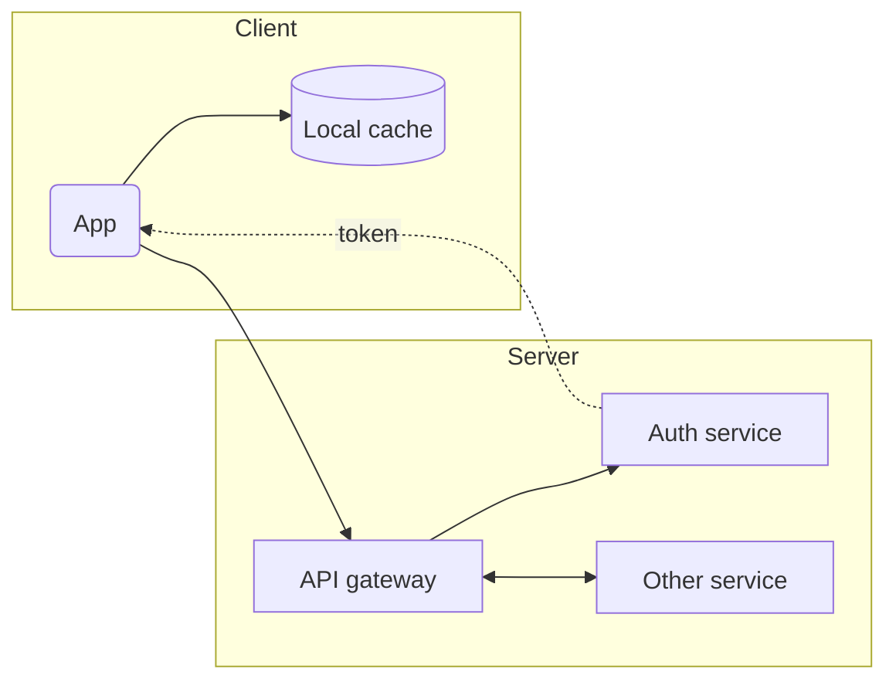
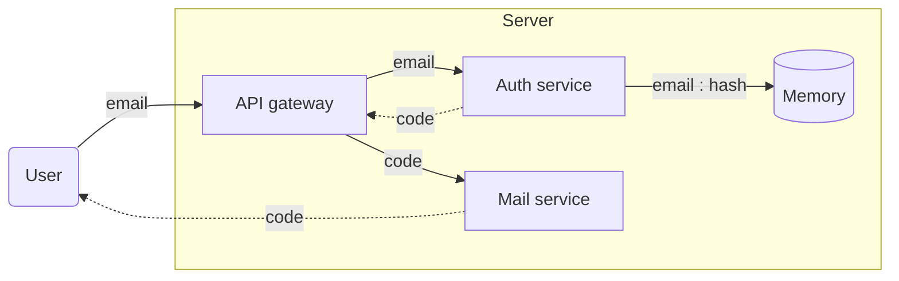
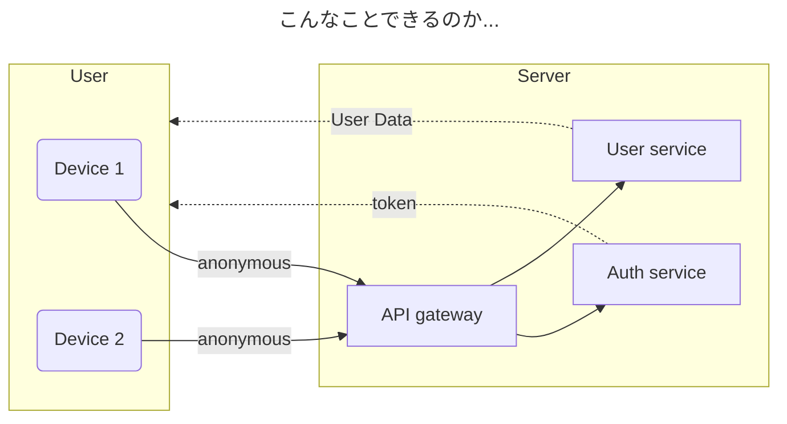

FRAME LUNCHのような小さなクリエイティブ会社だと、何か作ろうとなった際に、認証機能についてはメールとパスワードでログインできるようにしておけばいいや、となってしまう。そしてFirebase, Auth0, Cognitoのような、便利なIDaaS（SaaS?, BaaS?, わからない。。）を使うのである。

しかし、良いUXのために入り口が肝心なのは分かっているつもりである。自分でコントロール可能な認証の仕組みを実装することに価値があると考え、全体的にサーバーレスをやめてみるところから始めてみる。まず考え始めたことは以下の四つ。

1. JWTによるアクセストークンと、リフレッシュトークン
2. メールアドレス認証のために確認コードの仕組み
3. サービス利用の敷居を下げるために、匿名ユーザーを導入したい
4. 生体認証などを使い、パスワードレスにするために、WebAuthn APIを利用したい

新しいプロジェクトを始める時は、今まで経験したことのない何かに取り組みたい気持ちになるのだが、今回は、匿名ログインと、WebAuthnが、自分にとっての新しい試みという事になる。

# アクセストークン
ブラウザのCookieを利用したセッション管理は一昔前の懐かしい時代。今ではJWT（Json Web Token）によるアクセストークンをHTTP Headerに、Authorization = “Bearer: 〜”として、含ませるのが一般的（最近は他の方法を見かけない）。また、認証不要でアクセスできてしまうAPI（ログイン前に使うAPIなど）についても、正しいサービス利用かどうかの確認のためにJWTを使う。



## JWS（JSON Web Signature）
JWT自体は、JSONをBase64でエンコードしただけなので、改ざん検知の仕組みが必須である。
ここについては、ライブラリを使いたい。使い古されている仕様なのでライブラリの信頼性も高い。そして暗号までは手を出したら怖い気がする（いつかは手を出すかもしれないが）。

バックエンドをNode.jsで作るならば、以下を利用する。
JOSE（JSON Object Signing and Encryption）
https://www.npmjs.com/package/jose

アルゴリズムにはES256を選ぶ。SSHでRSAキーに散々お世話になってきた身としては、何も考えないとRS256を選びそうなところであるが、ここも最近の事情を調べると、ES256の方が短くてパフォーマンスも良いと教えてくれる。

しかし、ここで伏兵が。ふとした時に社員メンバーにSSHのための公開鍵を求めたところ、Ed25519を使っていた。ES256も、Ed25519も楕円曲線暗号を使っているものの、調べると古めのシステムや外部との連携が必要な場合は対応してないことはあるものの、パフォーマンスや堅牢さはEd25519が上回っているようだ。技術選定を始めるとこのような堂々巡りが、頻繁に起こりがちである。


## JSONに含める情報
好きなものをJSONに含めればいいと思うが、JWTの仕様（RFC7519）には予約済みクレーム（Registered Claims）、なるものがあるので、利用の際に使えそうなものは仕様に従ってみる。以下の情報は、含めるようにする。使うかどうかは別として。

- Issuer: 発行者。自分のサービスとわかる識別子（ドメインなど）
- Audience: 受信者。サービスのエコシステム内の1パート（アプリIDなど）
- Subject: 利用者識別のための情報（ユーザーIDなど）
- Expiration Time: JWTの有効期限
- JWT ID: JWTのユニークID

## リフレッシュトークン
アクセストークンを用いた認証は、リフレッシュトークンとセットで語られる。
よくあるお話として、アクセストークンの有効期限は短く（5分とか？）して、リフレッシュトークンは長め（1週間とか？）の有効期限にしておく。アクセストークンが切れた場合には、リフレッシュトークンを使って、新しいアクセストークンとリフレッシュトークンを手に入れるという方法。リフレッシュトークンが切れるまでは、再度のログインをする必要がなくなる。
リフレッシュトークンの有効期限が切れてしまった場合は、再度ログインをする必要があるが、そうではない場合はセッションを維持し続けることができる。

リフレッシュトークンを導入することで、安全性は高まる（と一般的に言われている）のだが、サーバーでも、フロントエンドでも、色々考えて実装する必要がある。

#### サーバー
- アクセストークンが切れている場合は、HttpStatus 401
- リフレッシュトークンを受けて、アクセストークンとリフレッシュトークンを再発行するエンドポイントを作る
- リフレッシュトークンは再利用できないようにする
- リフレッシュトークンの再利用を検知（悪用の可能性が高い）
- 保守側がアクセストークン失効できる仕組み（JWT IDを使った、ブラックリスト）
- WEBはCookie, アプリはレスポンスに含める

#### フロントエンド
- ネイティブアプリの場合アクセストークンとリフレッシュトークンをセキュアなローカルストレージに保持する
- WEBの場合、リフレッシュトークンは、Secure Cookieでやり取りをする。アクセストークンはlocal storageなど
- APIなどにアクセスした際に、Unauthorizedがレスポンスされると、リフレッシュトークンを使ってアクセストークンを更新。その後に、Unauthorizedがレスポンスされたリクエストを再チャレンジ。

フロントでもアクセストークンの有効期限を管理して、自発的に更新できるかもしれないが、試したことはない。

## WebSocket
少なくともアプリケーションがアクティブな時はコネクションを貼り続ける必要があることがほとんどだと思う。また、HttpHeaderも使えない。たくさんの事例がすでにあると思うが、この機会にちゃんと考えてみようと思う。ただ今回はスルーして、詳細は次回に。

# メールアドレス（または電話番号）の確認
利用ユーザーを特定する手段としては、メールアドレスと電話番号がまだ一般的だと思う。後ほど、言及するWebAuthnを使えば、メールアドレスや、電話番号の代わりに手持ちのデバイスを使えるようになるわけだが、メールアドレスも電話番号も、以下の理由によりまだまだ実用性はある。

- 複数の認証手段の確保（復元のための手段として）
- ユーザー本人との具体的な連絡手段に使える

メールアドレスにしろ、電話番号にしろ、ボットではないことを証明するために、確認コードによる証明フローが必須となる。



## 確認コードを作る
ランダムな数値はそんなに難しいことを考えずに自前で実装しておく。

```js
generateCode(length = 6) {
    return Math.floor(Math.random() * 10 ** length)
      .toString()
      .padStart(length, "0");
 }
```

## ハッシュ化
確認コードはhash化した値をバックエンドで保持する。ハッシュ値を比較することで、値が一致するかを検証する。確認コードは、一般的に、4 ~ 6桁のランダムな数値。
※ちなみに、ハッシュ化は不可逆で、暗号化は可逆です。

以前はMD5を使っていた記憶があるが、今では脆弱と見做されている。今回はArgon2を選ぶ。以下のライブラリを利用する。

argon2
https://www.npmjs.com/package/argon2

## ハッシュ値の保管
ハッシュ化した確認コードは、メールアドレスや、電話番号をベースとしたKeyで、Redis（オンメモリDB）に期限付きで格納する。よく、5分以内に確認コードを入力してくださいとメールなどに書いてある通り、その期限が過ぎたらRedisからデータが消えて無効になるようにする必要がある。また、一度使った確認コードは使えなくするために、確認が済んだ場合にはシステムが削除する。

Redisは10年以上前くらいにMemcachedの代わりに使い始めて、今でも現実的な選択肢なのが嬉しい。とはいえ、Redisの文脈も色々と話が膨らんでいるようなので、今度ゆっくり調べてみたいと思う。


## 確認コードの送信
確認コードをユーザーに伝えるために、メールの送信（SMTP）またはSMS送信の仕組みをバックエンドで持つ必要がある。
メール送信くらいは、利用可能なSMTPサーバーがすでにあれば、さほど難しいことではない。ただ、ちゃんとHTMLメールにして文面がデザインされたものにしたい。

電話番号の場合は、SMSによる認証が必要になる。ただしこれはなかなか難しくて、SMSを送信する電話の代わりになるようなサーバーが必要になる。普通のLinuxサーバーにはそんな機能はない。無理ではないと思うが、今の所は何かしらのサービスを利用した方が良さそう。Twilioや、Vonageなどが一般的なようだ。いつかAndroidやRaspberryPiを使って自作を試してもいいかもしれないが、今回はやめておく。


# 匿名ユーザー
ユーザー目線で言えば認証はとても煩わしい。なぜそんなにも他者に対して、自分が自分であることを一生懸命証明しないといけないのか、と。証明するために、いろいろな手続きが必要であることを、社会に出るくらいの年齢になる人であれば十分体験しているはずである。ユーザー認証の面倒くささも全く同じである。

本来的にユーザー認証が必要なサービスであっても、軽いノリで使い始めることができるのであればそれに越したことはない。そのために匿名ログインがある。しかし、実装側から見るとなかなかややこしい。今考えていることは以下。

- 同じ人が、いろいろなデバイスで匿名ログインの可能性
- 匿名ユーザーの機能制限（正規ログインと機能に違いを持たせないといけない）
- 匿名ユーザーの状態復元
- 複数の匿名ユーザーのデータのマージ



## 匿名ユーザーの作成
通常のユーザーと同様に、ユーザーを管理するテーブルに匿名ユーザーとしてのレコードを一つ追加して、UserIDを発行すれば良い。ただし、何をもって匿名ユーザーと判断するかは検討の余地がある。isAnonymous: trueみたいなフィールドを作るのか、はたまたメールアドレスのような正規ユーザーとして必須な情報があるかないかで判別すれば良いのか。

現時点での結論は先送り。個人的には、フラグのためにboolean型のフィールドを闇雲に増やしていくのは好きではない。こうしたことは後になってわかってくることが多い。サービスへのアクセス自体は、通常のユーザーと同様に、アクセストークンを利用すれば良い。

## 機能制限
匿名ユーザーなのだから、正規のユーザーとは、アプリケーション画面や、利用できる機能に違いがあることがほとんどだと思われる。ユーザーによっての画面の分岐があると言うのは、実装面では手間だし、テストや検証のコストが増えるため、前もって考えておく必要がある。

## 状態復元
匿名ログインであっても、発行されるアクセストークンの仕組みは同じである。となると、リフレッシュトークンの有効期限が切れてしまった場合、匿名ユーザーの状態は復元ができなくなると想像できる。果たしてそれで良いのか。

ECサイトのカートの中身を例に改めて考えると、自己完結であればそれでも良さそう。しかし、ユーザー同士で繋がりが生まれるようなサービスの場合、復元できないと困る。アクセストークンとは別に、仮のID/Passの組み合わせのようなものをサーバーで発行して、フロント側のローカルストレージで保持しておくのはどうか。セッションが切れた際はそれを使って復元処理を行う。

ちなみに、デバイスを識別するだけならば、スマホの固有ID（またはプログラムが生成したUUID）のようなものを使うこともできるとは思うが、復元という文脈では使わないほうが安全だとは思う。いつでも安全面を気にしないといけない。

## デバイスごとに同じ人が存在する
今ではPC、スマホ、タブレットなど様々なデバイスを駆使するのが現代人。デバイスごとの匿名ユーザーは、データベース上は違うユーザーとみなされるものの、蓋を開けてみたら同じユーザーだった、と言うことも考えられる。
そうした状況に陥った時に、データをマージする手段を考えておかなければならない。

# WebAuthn
メールアドレスや、パスワードではなく、デバイスをキーにして認証できるとするならば、公開鍵方式を利用して、パスワードレスでの認証ができる、というのは素敵な考え方だと思う。今では主要なOSベンダーのアカウントにOSレベルで紐づけられるようになっているらしい。
ただ、この方法は標準Web APIに組み込まれているものの、FIDO2, パスキー, 生体認証といった言葉が絡んできて、言葉の整理や、仕様の理解が難しい。様々なアプリが、パスキー認証を推奨するインフォメーションを目にする機会が多いが、普通のパスワード認証と何が違うかちゃんとわかる人は、まだまだ少ないのではないか。


WebAuthnにまつわる話や、標準Web APIとしての仕様は、まだまだ把握し切れてないが、まずは使ってみたい。Javascriptベースであれば、Simple Web Authnというライブラリが有名。こちらを利用する。
https://simplewebauthn.dev/

仕組みが公開鍵暗号方式であることはすぐにわかる。鍵の生成、鍵の保持、鍵の検証についての実装が待ち受けている予想する。WebAuthnは現在進行形であるため、内容は次回に持ち越したい。

# 終わりに
ユーザー認証の仕組みを導入したいだけなのに、考えることが多い。
過去に何度も、ユーザー認証の仕組みを作っているわけだし、一度実現できているものをそのまま流用すれば、開発時間の省略になる。しかし、定期的に見直すことで、新たなセキュリティの事や、思わぬ知見について得ることができる。面倒がらずに時間がある時に、しっかり考える時間を作ることも大事である。

匿名ログインとWebAuthnについては、別でちゃんと掘り下げるだけのボリュームがありそうなので、別の機会に書いてみたいと思います。
